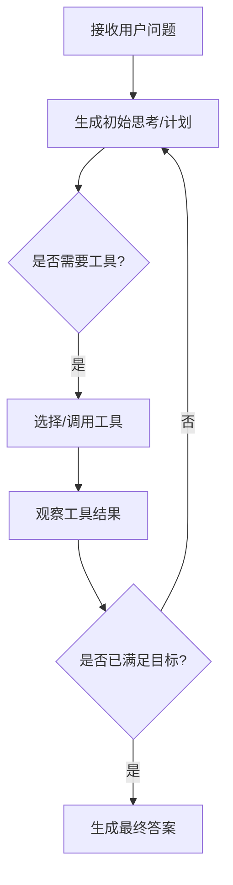

# LangChain 高级用法与工程实践

面向智能体（Agent）与知识增强（RAG）的系统化指南，涵盖设计原理、工具集成、MCP（多链并行）、记忆系统与性能调优。所有示例均采用社区主流风格与类型注释，并包含可运行的配置要点与实际应用场景建议。

建议环境：`langchain>=0.2.16`，配合 LCEL（LangChain Expression Language）与 `langchain_core` 运行时组件。

---

## 1. 智能体设计

### 原生智能体设计原理
- 核心思想：将 LLM 的“思考-行动-观察（ReAct）”循环结构化为可控的执行器（AgentExecutor），通过工具（Tools）与环境交互，并基于记忆与上下文做策略迭代。
- 要素构成：
  - Prompt：约束角色、目标、工具使用规范、输出格式等；
  - Tools：具备明确输入输出契约（函数签名/模式），对外部能力进行封装；
  - Planner/Policy：将复杂任务分解为步骤，并决定何时调用工具；
  - Executor/Loop：驱动多轮“思-行-观”，直到满足停止条件（完成/超时/步数上限）。

### 标准流程与最佳实践
- 标准流程：
  1. 明确目标与成功标准（Definition of Done）；
  2. 选型与准备工具（搜索、计算、检索、Web 操作等）；
  3. 设计提示词模板（含输入变量、工具指令、输出结构）；
  4. 构建 Agent（ReAct / Function Calling / 自定义 Policy）；
  5. 执行与监控（日志、错误处理、步数/时间预算）；
  6. 复盘与演进（记忆写入、质量评估、策略优化）。
- 最佳实践：
  - 强类型工具参数（Pydantic 模型），保证清晰可控；
  - 输出统一结构（JSON/Markdown），便于前端展示与测试；
  - 日志与错误处理统一（结构化日志、异常分类）；
  - 限流与预算控制（步数上限、超时、失败重试）；
  - 将环境依赖抽象为接口，便于替换与模拟测试。

### 决策逻辑示意图


### 代码示例：构建 ReAct Agent（LCEL + AgentExecutor）
```python
"""构建一个最小 ReAct Agent 示例。

- 使用可调用工具（搜索/计算器）
- 基于 AgentExecutor 驱动决策循环
"""
from __future__ import annotations

from typing import Any, Dict, List
from langchain_core.tools import Tool
from langchain.agents import AgentExecutor, create_react_agent
from langchain_openai import ChatOpenAI

# 工具：DuckDuckGo 搜索（示意）
def web_search(query: str, max_results: int = 5) -> List[Dict[str, str]]:
    """执行 Web 搜索并返回若干条结果。"""
    # 生产环境建议复用已封装工具（见 tools/web_search.py）
    return [{"title": f"{query} - 示例结果", "link": "https://example.com"}]

# 工具：安全计算器（示意）
def evaluate_expression(expression: str) -> str:
    """评估表达式，返回字符串结果。"""
    return "42"  # 示例固定返回

tools = [
    Tool(name="web_search", func=web_search, description="执行Web搜索，返回标题与链接"),
    Tool(name="evaluate_expression", func=evaluate_expression, description="安全计算表达式"),
]

llm = ChatOpenAI(model="gpt-4o-mini", temperature=0)

prompt = (
    "你是一个善于规划与工具使用的智能体。\n"
    "当需要查询信息时调用 web_search；当需要计算时调用 evaluate_expression。\n"
    "请给出清晰的推理与最终答案。"
)

agent = create_react_agent(llm, tools, prompt)
executor = AgentExecutor(agent=agent, tools=tools, verbose=True)

result = executor.invoke({"input": "搜索LangChain并计算(12+5)*3"})
print(result["output"])  # 输出：最终答案
```

实际应用场景：
- 项目中的基础问答 Agent（`src/agent101/agents/base_qa.py`）采用 ReAct + Function Calling；可用此流程扩展更多工具与策略。

---

## 2. 工具集成

### 常用工具类型与适用场景
- 信息类：Web 搜索、网页抓取、API 查询（适合知识检索与事实查找）
- 计算类：数学/统计/单位换算（适合数值推理与表格处理）
- 文件类：PDF/Word/Excel 解析（适合文档摘要、结构化提取）
- 系统类：数据库/缓存/消息队列（适合任务编排与状态管理）

### 注册与调用的标准方法（LCEL/Agents）
- `Tool`/`StructuredTool`：
  - `Tool` 适合简单签名函数；
  - `StructuredTool` 适合 Pydantic 参数模型，类型更清晰可校验。
- Agent 层使用函数调用或 ReAct 选择合适工具。
- LCEL 层通过 `Runnable` 组合工具与链路。

### 工具开发规范示例
```python
"""工具开发规范示例：结构化参数 + 清晰的错误处理。"""
from __future__ import annotations

from typing import List, Dict
from pydantic import BaseModel, Field
from langchain_core.tools import StructuredTool

class SearchInput(BaseModel):
    query: str = Field(..., description="搜索关键词")
    max_results: int = Field(5, ge=1, le=20, description="返回数量")

def web_search_tool(query: str, max_results: int = 5) -> List[Dict[str, str]]:
    try:
        # 生产环境：调用已封装工具或三方服务
        return [{"title": query, "link": "https://example.com"}][:max_results]
    except Exception as exc:  # 统一错误处理
        raise RuntimeError(f"搜索失败: {exc}")

WebSearch = StructuredTool.from_function(
    func=web_search_tool,
    name="web_search",
    description="DuckDuckGo 搜索工具",
    args_schema=SearchInput,
)
```

实际应用场景：
- 结合 `src/agent101/tools/` 中的工具（`web_search.py`, `web_fetch.py`, `calculator.py`），为 Agent 注册工具时统一入口与校验。

---

## 3. MCP（多链并行）

### 工作原理
- 多链并行（Multi-Chain Parallel）指将多个可运行链路（Runnable/Chain）并行执行，以提升吞吐与缩短响应时间；适用于 I/O 密集（搜索/抓取/检索）与独立子任务（多源检索、多文档处理）。

### 并行执行配置（LCEL）
```python
"""使用 RunnableParallel 并行执行多路任务。"""
from __future__ import annotations

from langchain_core.runnables import RunnableLambda, RunnableParallel

def search_news(topic: str):
    return [f"{topic}-news-1", f"{topic}-news-2"]

def search_papers(topic: str):
    return [f"{topic}-paper-1", f"{topic}-paper-2"]

parallel = RunnableParallel(
    news=RunnableLambda(lambda x: search_news(x["topic"])),
    papers=RunnableLambda(lambda x: search_papers(x["topic"])),
).with_config({"max_concurrency": 4})  # 并发上限

result = parallel.invoke({"topic": "LangChain"})
print(result)
```

### 性能优化建议
- 将重 I/O 任务并行化，合理设置 `max_concurrency`；
- 使用异步客户端（如 `aiohttp`）与批量接口（Embedding 批量）；
- 对重复查询启用缓存（`langchain.cache`）与去重；
- 针对长尾超时设置失败重试与降级策略；
- 任务切片与回收（避免一次性处理过大集合）。

实际应用场景：
- 研究助理中可并行抓取多篇 PDF 的摘要；网页 Agent 中并行抓取多个页面的标题与文本。

---

## 4. 记忆系统

### 实现方式：短期记忆（会话级）
- LCEL：`RunnableWithMessageHistory` 将会话历史注入到 Prompt；
- ChatMessageHistory：基于会话 ID 存取消息，支持多用户隔离；
- 策略：窗口化（最近 N 条）、摘要化（节省 token）。

```python
"""使用 RunnableWithMessageHistory 管理会话记忆。"""
from __future__ import annotations

from typing import Dict
from langchain_openai import ChatOpenAI
from langchain_core.messages import AIMessage
from langchain_core.runnables.history import RunnableWithMessageHistory
from langchain_core.chat_history import InMemoryChatMessageHistory

llm = ChatOpenAI(model="gpt-4o-mini", temperature=0)

store: Dict[str, InMemoryChatMessageHistory] = {}

def get_history(session_id: str) -> InMemoryChatMessageHistory:
    if session_id not in store:
        store[session_id] = InMemoryChatMessageHistory()
    return store[session_id]

chain = RunnableWithMessageHistory(
    llm,
    get_history,
    input_messages_key="input",
    history_messages_key="history",
)

resp = chain.invoke({"input": "你好，记住我喜欢LangChain。"}, config={"configurable": {"session_id": "u1"}})
assert isinstance(resp, AIMessage)
```

### 实现方式：长期记忆（向量库）
- 使用 `Chroma`/`FAISS` 等向量存储持久化记忆；
- Embeddings：`OpenAIEmbeddings`/`SentenceTransformers`；
- 检索：基于相似度/MMR，结合元数据过滤。

```python
"""使用 Chroma 构建长期记忆并检索。"""
from __future__ import annotations

from langchain_community.vectorstores import Chroma
from langchain_openai import OpenAIEmbeddings

emb = OpenAIEmbeddings(model="text-embedding-3-small")
vs = Chroma(collection_name="long_memory", embedding_function=emb, persist_directory=".chroma")

# 写入记忆
vs.add_texts(["用户u1喜欢LangChain与RAG"], metadatas=[{"user_id": "u1"}])
vs.persist()

# 检索记忆
retriever = vs.as_retriever(search_kwargs={"k": 3})
docs = retriever.get_relevant_documents("u1 喜欢什么?")
```

### 配置示例与优化策略
- 配置：持久化目录、`k` 值、相似度阈值、MMR 开关；
- 优化：
  - 对冗余内容做去重/摘要；
  - 调整 chunk 大小与 overlap（RAG 相关）；
  - 结合 `ContextualCompressionRetriever` 压缩无关片段；
  - 元数据（时间/来源/用户）便于过滤与治理。

实际应用场景：
- 本项目中的长期记忆可通过 `src/agent101/memory.py`（如存在）或向量库模块配置；服务端端点可根据 `enable_vector_memory` 切换写入/检索。

---

## 5. RAG 增强

### 集成方法（LCEL）
- 流程：加载 -> 切分 -> 嵌入 -> 入库 -> 检索 -> 生成；
- LCEL 组合：`retriever | select | prompt | llm`；
- 增强：重排序、压缩检索、链路缓存、来源引用。

```python
"""构建一个最小 RAG 流程（LCEL）。"""
from __future__ import annotations

from langchain_openai import ChatOpenAI, OpenAIEmbeddings
from langchain_community.document_loaders import TextLoader
from langchain_text_splitters import RecursiveCharacterTextSplitter
from langchain_community.vectorstores import Chroma
from langchain_core.runnables import RunnableLambda, RunnablePassthrough
from langchain_core.prompts import ChatPromptTemplate

# 1) 加载与切分
docs = TextLoader("docs/sample.txt", encoding="utf-8").load()
splitter = RecursiveCharacterTextSplitter(chunk_size=800, chunk_overlap=120)
splits = splitter.split_documents(docs)

# 2) 向量库
emb = OpenAIEmbeddings(model="text-embedding-3-small")
vs = Chroma.from_documents(splits, emb, collection_name="kb", persist_directory=".chroma")
retriever = vs.as_retriever(search_type="mmr", search_kwargs={"k": 4})

# 3) Prompt
prompt = ChatPromptTemplate.from_messages([
    ("system", "你是严谨的知识问答助手，使用给定上下文回答问题，并引用来源。"),
    ("human", "问题: {question}\n上下文: {context}"),
])

llm = ChatOpenAI(model="gpt-4o-mini", temperature=0)

def format_docs(docs):
    return "\n\n".join([f"[{i.source}]\n{ i.page_content }" for i in docs])

rag_chain = (
    {"context": retriever | RunnableLambda(format_docs), "question": RunnablePassthrough()}
    | prompt
    | llm
)

resp = rag_chain.invoke("什么是 LangChain?")
print(resp.content)
```

### 知识库构建与检索步骤
- 数据侧：多源加载（文本/PDF/网页/数据库）与清洗；
- 切分策略：`RecursiveCharacterTextSplitter` 优先；中文建议基于标点/段落边界；
- Embeddings：OpenAI 或开源向量模型（速度/成本权衡）；
- 存储：`Chroma`（便捷）或 `FAISS`（更轻量）；
- 检索：优先 `MMR` 与元数据过滤；必要时引入重排序器。

### 性能调优指南
- 召回：调整 `k`、相似度阈值、MMR；
- 压缩：`ContextualCompressionRetriever`（如冗余分片多）；
- 缓存：链路级缓存与向量查询缓存；
- 批量：Embedding 批量写入与并行检索（结合 MCP）；
- 评估：基于真实问题集做离线 A/B 测试（精确率/召回率/响应时间）。

实际应用场景：
- 研究助理（`src/agent101/research/`）即采用检索+摘要的变体；
- 文件 Agent 可将解析内容入库，形成文档问答。

---

## 附录：配置与工程化建议
- 环境变量：
  - `OPENAI_API_KEY`：LLM 与 Embeddings；
  - `EMBEDDING_MODEL`：如 `text-embedding-3-small`；
  - `CHROMA_PERSIST_DIR`：向量库持久化目录。
- 错误处理：统一捕获与分类（网络/解析/超时），返回结构化错误；
- 日志：模块化 `logger`，在服务端以 `HTTP 500 + detail` 暴露；
- 测试：为工具与链路编写可独立测试的用例；
- 文档：所有函数/类含目的、参数、返回值与异常说明的注释（JSDoc/Google-style）。

---

## 审核与后续
请审核本文档的结构与内容。如果需要，我可将上述示例落地到项目代码：
- 增加并行检索与缓存的实装；
- 为现有 Agent 工具集添加结构化参数与更多类型；
- 将记忆系统接入服务端点（启用会话记忆与长期记忆）；
- 将 RAG 流程整理为可复用的 LCEL 组件与端到端评估脚本。

---

## 运行演示脚本

为方便你直接验证本文档示例，已在 `scripts/` 目录提供以下可运行脚本：

- ReAct Agent：
  - 路径：`scripts/demo_langchain_react_agent.py`
  - 运行：`python scripts/demo_langchain_react_agent.py --question "搜索LangChain并计算(12+5)*3"`
- MCP 并行：
  - 路径：`scripts/demo_langchain_mcp.py`
  - 运行：`python scripts/demo_langchain_mcp.py --topic "LangChain"`
- 会话记忆：
  - 路径：`scripts/demo_langchain_memory.py`
  - 运行：`python scripts/demo_langchain_memory.py --session u1`
- RAG 流程：
  - 路径：`scripts/demo_langchain_rag.py`
  - 运行：`python scripts/demo_langchain_rag.py --question "什么是 LangChain?" --doc docs/sample.txt`

注意事项：
- 需要设置环境变量 `OPENAI_API_KEY`；
- 已在 `requirements.txt` 增加 `langchain-text-splitters` 以支持 RAG 示例；
- 首次运行 RAG 会在 `.chroma/` 目录创建向量库持久化数据。